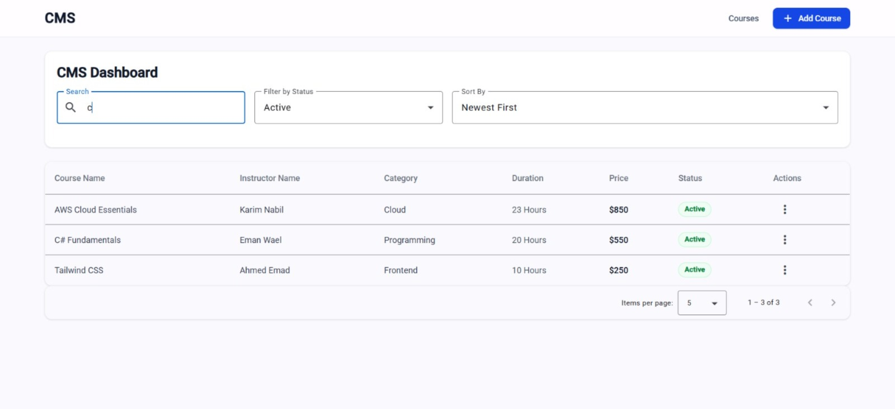
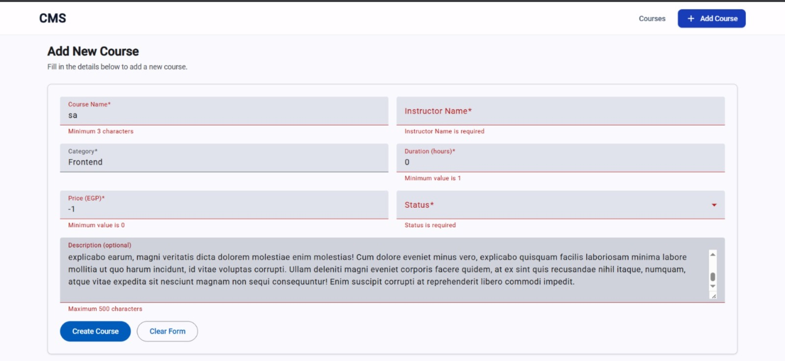
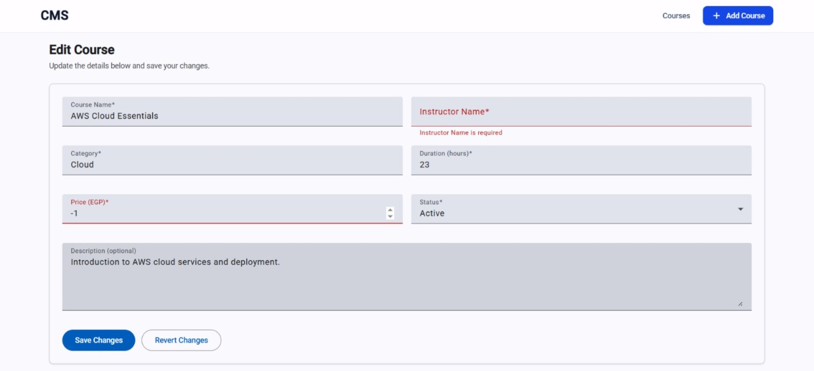
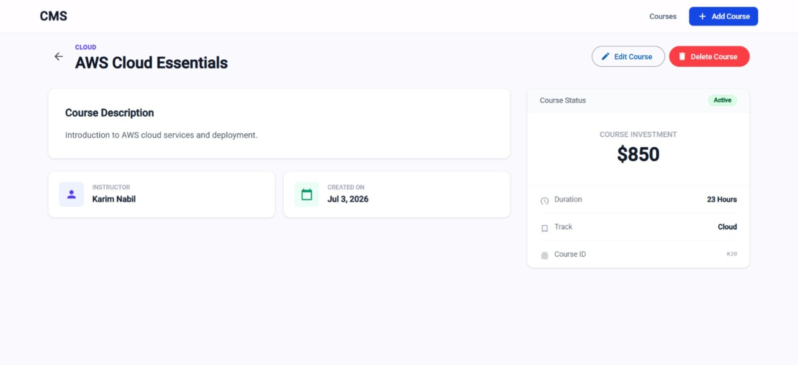

# 📚 Course Management System

A modern Course Management Dashboard built with Angular, designed for managing educational courses through a clean, responsive interface. Built as part of a technical assessment to demonstrate Angular architecture, reactive forms, CRUD operations, and UI/UX best practices.

---

## ✨ Features Implemented

### Core Features
- View all courses in a responsive table layout
- Add a new course with full form validation
- Edit an existing course (form pre-populated with course data)
- Delete a course with a confirmation dialog
- View full course details on a dedicated page
- Search courses by course name
- Filter courses by status (Active, Draft, Archived)

### Bonus Features
- ✅ Confirmation modal before deletion
- ✅ Toast / Snackbar notifications for actions (add, edit, delete)
- ✅ Loading skeletons (table skeleton + form skeleton + details skeleton)
- ✅ Empty state component when no courses exist
- ✅ Error state component for failed API requests
- ✅ Route guard (`form-exit`) to warn before leaving unsaved form
- ✅ Reusable table component (`generic-table`)
- ✅ Reusable form field component
- ✅ 404 Not Found page
- ✅ Clean and scalable folder structure (feature-based)

---

## 🛠️ Tech Stack

| Technology | Purpose |
|---|---|
| Angular 22 (Standalone) | Core framework |
| TypeScript | Type safety and interfaces |
| Angular Material | UI component library |
| Tailwind CSS | Utility-first styling |
| RxJS | Reactive data streams |
| JSON Server + Railway | Mock REST API (local + live) |

> **Note:** This project uses Angular's modern **standalone components** approach instead of NgModules. There is no `CoursesModule` or `AppModule` — routing and providers are configured directly in `app.config.ts` and `app.routes.ts`.

---

## 📂 Project Structure

```text
├───public
│       favicon.ico
│
└───src
    │   index.html
    │   main.server.ts
    │   main.ts
    │   material-theme.scss
    │   server.ts
    │   styles.css
    │
    ├───app
    │   │   app.config.server.ts
    │   │   app.config.ts
    │   │   app.css
    │   │   app.html
    │   │   app.routes.server.ts
    │   │   app.routes.ts
    │   │   app.spec.ts
    │   │   app.ts
    │   │
    │   ├───core
    │   │   └───services
    │   │       ├───dialog
    │   │       │       dialog.spec.ts
    │   │       │       dialog.ts
    │   │       │
    │   │       └───snackbar
    │   │               snackbar.spec.ts
    │   │               snackbar.ts
    │   │
    │   ├───features
    │   │   └───courses
    │   │       ├───components
    │   │       │   ├───course-details-skeleton
    │   │       │   └───empty-courses-state
    │   │       │
    │   │       ├───guards
    │   │       │   └───form-exit
    │   │       │           form-exit-guard.spec.ts
    │   │       │           form-exit-guard.ts
    │   │       │
    │   │       ├───models
    │   │       │       ICourse.ts
    │   │       │       IMinCourse.ts
    │   │       │
    │   │       ├───pages
    │   │       │   ├───course-details
    │   │       │   ├───course-form
    │   │       │   └───course-list
    │   │       │
    │   │       └───services
    │   │           └───courses
    │   │               │   courses.spec.ts
    │   │               │   courses.ts
    │   │               │
    │   │               └───deleteCourseAction
    │   │                       delete-course-action.spec.ts
    │   │                       delete-course-action.ts
    │   │
    │   ├───pages
    │   │   └───not-found
    │   │
    │   └───shared
    │       └───components
    │           ├───confirm-dialog
    │           ├───error-state
    │           ├───form-field
    │           ├───form-skeleton
    │           ├───generic-table
    │           ├───navbar
    │           └───table-skeleton
    │
    └───enviroments
            enviroment.ts
```

---

## 🚀 Getting Started

### Prerequisites

- Node.js `^22.22.3` or `^24.0.0`
- npm 10+
- Angular CLI: `npm install -g @angular/cli`

### 1. Clone the repository

```bash
git clone https://github.com/omaremad20/Course-Management-Dashboard.git
cd Course-System-Management
```

### 2. Install dependencies

```bash
npm install
```

### 3. Run the application

```bash
ng serve
```

Navigate to:

```
http://localhost:4200
```

The live demo is deployed on Vercel and uses a hosted Railway backend, so the app works out of the box without any local setup.

---

## 🗄️ API / Backend

The mock backend is built with **JSON Server** and deployed on **Railway**, so it is always live — no local server setup required to run the app.

### Live backend

```
https://course-system-management-backend-production.up.railway.app
```

### API Endpoints

| Method | Endpoint | Action |
|---|---|---|
| GET | `/courses` | Fetch all courses |
| GET | `/courses/:id` | Fetch a single course |
| POST | `/courses` | Add a new course |
| PUT | `/courses/:id` | Update a course |
| DELETE | `/courses/:id` | Delete a course |

### Sample course record

```json
{
  "id": "a1b2c3d4-...",
  "courseName": "Angular Fundamentals",
  "instructorName": "Ahmed Ali",
  "category": "Frontend",
  "duration": 20,
  "price": 1500,
  "status": "Active",
  "description": "A comprehensive introduction to Angular.",
  "createdDate": "2026-06-01"
}
```

### Running locally (optional)

To switch to a local backend instead of Railway:

1. Start the local JSON Server:

```bash
npm run mock-api
```

2. Open `src/app/features/courses/services/courses/courses.ts` and change:

```typescript
// From (production):
private readonly URL = environment.PROD_API_URL_BACKEND;

// To (local):
private readonly URL = environment.DEV_API_URL_BACKEND;
```

The local server runs at `http://localhost:3000`.

---

## 📸 Screenshots










---

## 💡 Assumptions

- The project uses Angular **standalone components** (no NgModules), which is the recommended approach in Angular 17+. This replaces `CoursesModule` and `AppModule` with `app.config.ts` and direct route-level providers.
- Course IDs are generated client-side using `crypto.randomUUID()` before being sent to the API.
- The `createdDate` field is automatically set to today's date when adding a new course.
- `IMinCourse` is a lightweight interface used specifically in the delete confirmation dialog to display only the course name, without passing the full course object.

---

## 🔗 Links

- **Live Demo:** [https://course-management-panel.vercel.app/list](https://course-management-panel.vercel.app/list)
- **GitHub:** [https://github.com/omaremad20/Course-Management-Dashboard.git](https://github.com/omaremad20/Course-Management-Dashboard.git)

---

## 👨‍💻 Author

**Omar Emad**

- GitHub: [https://github.com/omaremad20](https://github.com/omaremad20)
- Email: [omarremaddalii@gmail.com](mailto:omarremaddalii@gmail.com)